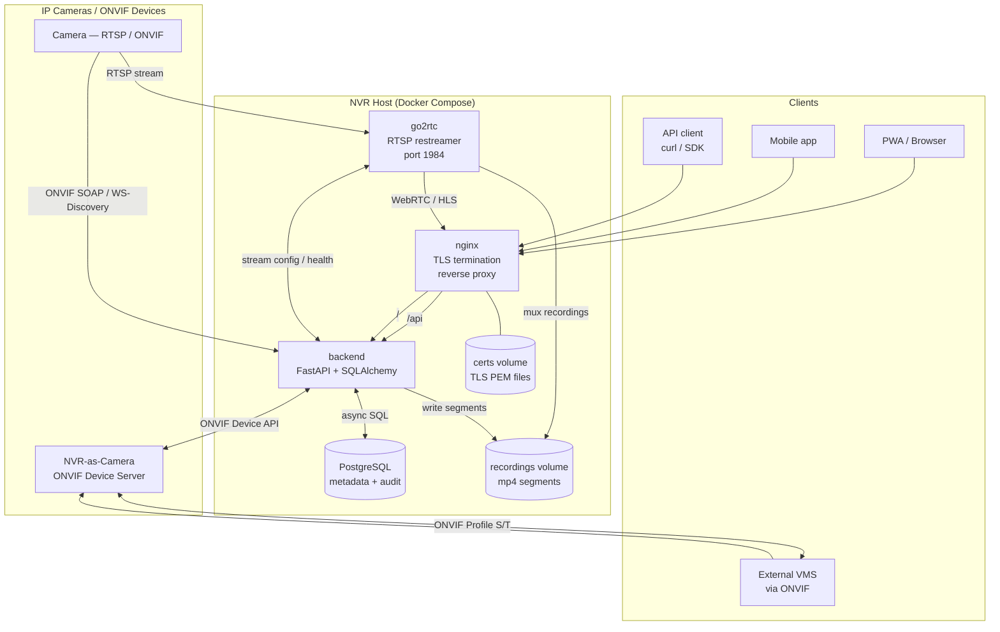

# GVD NVR

Enterprise-grade Network Video Recorder built on FastAPI + React, with ONVIF support, go2rtc restreaming, and a Docker-first deployment model.

## Quick Start

**Linux / macOS**

```bash
sudo bash install.sh
```

**Windows** (PowerShell)

```powershell
Set-ExecutionPolicy -Scope Process -ExecutionPolicy Bypass
.\install.ps1
```

After install, open **https://localhost** in your browser (accept the self-signed certificate warning) and log in with the admin credentials you entered during setup.

## Full Installation Guides

- [Windows Installation Guide](docs/INSTALL_WINDOWS.md)
- [Linux Installation Guide](docs/INSTALL_LINUX.md)

## Managing the Stack

| Platform | Command |
|---|---|
| Linux / macOS | `bin/nvr.sh <command>` or `make <target>` |
| Windows (PowerShell) | `.\bin\nvr.ps1 <command>` |
| Windows (cmd.exe) | `bin\nvr <command>` |

Common commands: `up` · `down` · `logs [service]` · `rebuild` · `migrate` · `ps`

## Architecture



**Data flow summary**: Cameras push RTSP streams to go2rtc, which forwards them to browsers via WebRTC and muxes recordings to disk. The FastAPI backend orchestrates ONVIF device management, writes metadata to PostgreSQL, and serves the React frontend through nginx. External VMS systems connect to the built-in ONVIF Device Server. All external traffic terminates at nginx with TLS.

## Component Table

| Component | Description |
|---|---|
| `backend/` | FastAPI + SQLAlchemy async + Alembic migrations |
| `frontend/` | React + shadcn/ui |
| go2rtc | RTSP restreamer (port 1984) |
| nginx | TLS termination + reverse proxy |
